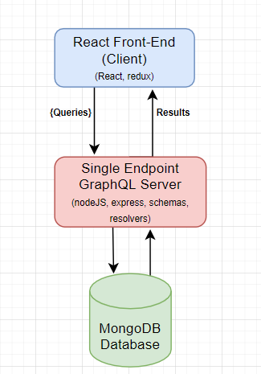
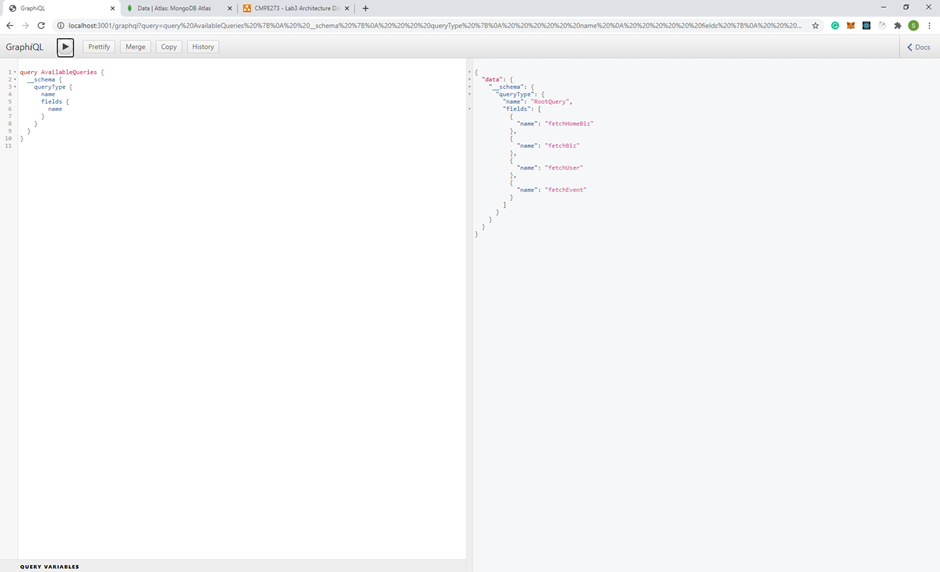
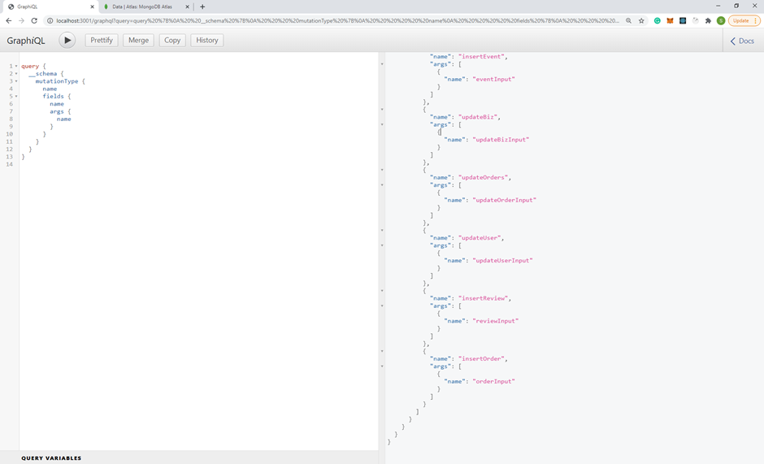

#### **CMPE273 - Lab3**

Yelp Prototype application

In Lab3, we have implemented the GraphQL to replace the REST APIs. 

**About GraphQL**

GraphQL is a query language for APIs and a runtime for fulfilling those queries with your existing data. GraphQL provides a complete and understandable description of the data in your API, gives clients the power to ask for exactly what they need and nothing more, makes it easier to evolve APIs over time, and enables powerful developer tools.

**Architecture Diagram**

**GraphQL queries**

**GraphQL Mutations**

